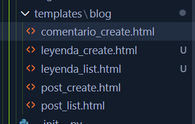
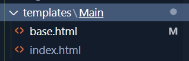

# TERCER-ENTREGA

# Soy Ezequiel Basualdo, y presento aqui la tercer entrega de mi cursada de Python para Coder House.
# Se presenta en esta tercer entrega un proyecto de blog para que guitarristas y bajistas de todo tipo comenten sus experiencias en el mundo de la música o sus pensamientos creando asi una comunidad. Tambien hay una seccion de Leyendas donde se podrá ver diferentes artista de la historia junto a su información personal. 

# El proyecto esta realizado en un ambiente de Django con Python, HTML, CSS y Bootstrap a través de la aplicación Visual Code. Cuenta con 2 apps, blog Y Main. Blog posee 4 archivos HTML, y Main 2. Es necesario aclarar que todos los templates HTML heredan de base.html excepto por su puesto, por este último.

# El administrador tiene el username de admin, y la contraseña 123

# La web tiene una pagina principal donde se aprecia unas imagenes (represntacion de imagenes subidas por usuarios), y arriba en el navegador se puede ir a blogs para crear de usuarios, o 

# ---------------------------------------------------------------------------------------------------------------------

# Templates 
.

# Templates de blog:
# comentario_create.html: Es el modulo donde se establece el form para agregar comentarios a las publicaciones. Se puede acceder a través de Blog en la pagina inicial.

# leyenda_create.html: Es el modulo donde se establece el form para agregar Leyendas al sitio web, unicamente por administradores registrado por el momento. Se puede acceder a través de Leyendas en la pagina inicial.

# leyenda_list.html : muestra la lista de las leyendas agregadas em el mismo sitio que el de leyenda_create

# post_create.html: Es el modulo donde se establece el form para agregar publicaciones al sitio web. Se puede acceder a través de Blog en la pagina inicial.

# post_list.html: Es el módulo donde se agregan los blogs creados, y se puede acceder igual que post_create.html.

# Templates de Main: 

# base.html: se usa como el template padre, donde se establecen los metadatos en UTF-8, se aplican los bootstraps, y se establecen los links de navegación.

# index.html: utiliza al igual que todos los demas templates, el base.html como template padre, y se establecen los links de navegación, y se agrega un carousel con imagenes de las leyendas agregadas al sitio web.

# -----------------------------------------------------------------------------------------------------------------

# admin.py: solo se encuentra en la app blog, se utiliza para establecer los formularios que se puden trabajar dentro de la vista admin, siendo estos blogs y Leyendas.

# -----------------------------------------------------------------------------------------------------------------

# forms.py: solo se blog. Este código crea formularios en Django para que los usuarios puedan agregar o editar publicaciones (PostForm), comentarios (ComentarioForm), leyendas musicales (LeyendaForm), y buscar contenido con un formulario de búsqueda (SearchForm). Cada formulario está basado en los modelos correspondientes, lo que facilita la recolección junto con el manejo de datos en la base de datos.

# -----------------------------------------------------------------------------------------------------------------

# models.py: se crean los modelos de Posts, Comentarios y Leyendas. Cada uno tiene su formulario en forms.py

# -----------------------------------------------------------------------------------------------------------------

# urls.py: Este código define las URLs (direcciones web) para el blog. Estas son "/post/list", "/post/create", "/comentario/create/int:post_id/", "/leyendas/", "/leyendas/create/"

# -----------------------------------------------------------------------------------------------------------------

# views.py: Este código define las vistas para el blog. Esta gestiona la lógica para el servidor, es decir, lo que no vemos.En este caso, se definen vistas para listar publicaciones, crear publicaciones, crear comentarios, listar leyendas y crear leyendas. También se incluye una vista para buscar contenido en el blog. Cada vista utiliza los modelos y formularios definidos en models.py y forms.py, respectivamente, para interactuar con la base de datos y manejar la lógica de la aplicación.

